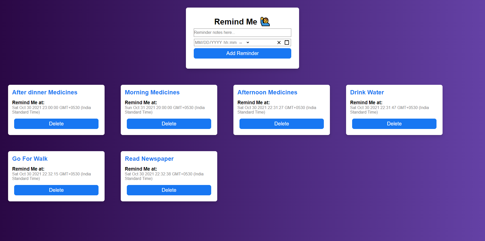
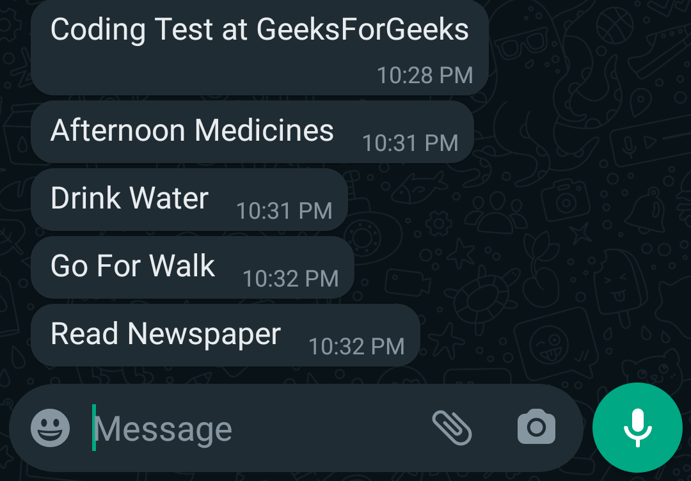

# Remind me

#### Home Page

#### Whatsapp Screenshot

Simple to use Reminder Application in which user can create reminder, as well as can delete the reminder, after setting reminder user will be notified on their whatsapp.😀

# Commands

### 'npm start' for frontend

### 'node index.js' for backend

# Tech stack

### frontend - React.js, HTML, CSS, Javascript
### backend - Node.js, Express.js, Mongodb

# TO use project first

### 'npm install' in both frontend and backend
### In backend setup .env twilio ACCOUNT_SSID and AUTH_TOKEN, WHATSAPP_FRON and WHATSAPP_TO